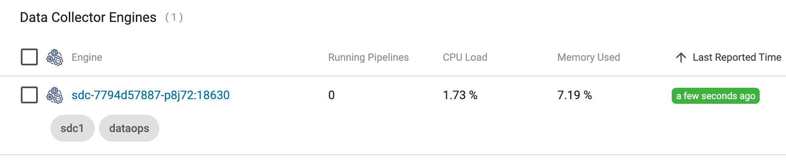

## dataops-sdc-on-k8s-without-control-agent

## This project has been deprecated and should no longer be used. Use DataOps Platform's [Kubernetes Agent](https://docs.streamsets.com/portal/platform-controlhub/controlhub/UserGuide/Environments/Kubernetes.html#concept_h4j_m4g_2vb) to deploy StreamSets Engines on Kubernetes instead, for the following reasons:

### -- DataOps Platform's Kubernetes Agent runs as a non-root user
###  -- Auth tokens generated for StreamSets Engines by the DataOps Platform's Kubernetes Agent are not tied to a user account, and are not vulnerable to being deactivated due to a user deactivation
### -- DataOps Platform's Kubernetes Agent supports StreamSets Engines configured with HTTPS, so "TLS all the way down" is now fully supported by DataOps Platform's Kubernetes Agent 

### Overview

This project shows an example of deploying an instance of StreamSets [Data Collector Engine](https://streamsets.com/products/dataops-platform/data-collector-engine/) on StreamSets [DataOps Platform](https://streamsets.com/products/dataops-platform/) without using a Control Agent

### Deploying the Example

- Clone this project to your local machine.

- Generate a set of DataOps Platform [API Credentials](https://docs.streamsets.com/portal/platform-controlhub/controlhub/UserGuide/OrganizationSecurity/APICredentials_title.html?hl=api)

- Edit the file <code>deploy.sh</code> and set the variables at the top of the file:
  
  Your settings might look like this:

        SCH_ORG_ID=8aaaaaaa-1111-1111-aaaaa-111111111111  
        SCH_URL=https://na01.hub.streamsets.com         
        SCH_CRED_ID=<redacted>      
        SCH_CRED_TOKEN=<redacted>        
        KUBE_NAMESPACE=ns1

- Edit the ConfigMap <code>yaml/dpm-configmap.yaml</code> and set <code>dpm.base.url</code>  to the URL for your region:
  
        dpm.base.url=https://na01.hub.streamsets.com    
  
  Set one or more Labels for the SDC in a comma-delimited string like this:
  
        dpm.remote.control.job.labels=sdc1,dataops
        
  This ConfigMap will be mounted as <code>$SDC_CONF/dpm.properties</code>
    

  
- Execute the <code>deploy.sh</code> script.  

  The script performs the following steps:
  
  - Creates the target namespace if it does not exist
  - Generates an <code>sdc.id</code> and stores it in a Secret
  - Generates a Control Hub auth token for SDC and stores it in a Secret
  - Creates a ConfigMap to hold <code>dpm.properties</code> values
  - Creates an SDC Deployment with Volume Mounts for the Secrets and ConfigMap

  
   When you run the script you should see output like this:

        $ ./deploy.sh
        namespace/ns1 created
        Context "mark-aks" modified.
        secret/sdc-id created
        Generated an Auth Token for SDC
        secret/sdc-auth-token created
        configmap/dpm-config created
        deployment.apps/sdc created
        
  After a minute or so you should see the registered SDC show up in Control Hub's Engines >  Data Collector List, with the specified Labels:
  
  
  
  
- You can test that the SDC's auth token remains valid by deleting the SDC's Pod and waiting for it get recreated.  The new Pod should resume heart-beating to Control Hub and function normally.
   
